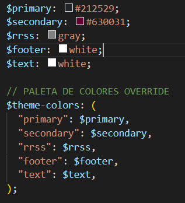

## AUTOR: Santiago Martínez
## ASIGNATURA: DIW
## FECHA DE ENTREGA: 28/01/2022

## ENLACE NETLIFY: https://hardcore-fermi-b52852.netlify.app/index.html

## COMPONENTS USADOS:
<ul>
    <li>NAVBAR: se ha usado una navbar + collapse responsive; es decir, una barra en el top de la página por la que navegar por los distintos enlaces que, a la hora de llegar al md de la página, se cambia el menú por una imagen "hamburguesa", la cual al pulsar se despliega el menú que antes era visible.</li>
    <li>CARDS: se han usado plantillas de cartas predefinidas por Bootstrap pero se han tenido que modificar acorde a la fidelidad de la página en cuanto a colores, posicionamiento de las imágenes y demás. Se ha hecho uso de Grid y Flex para configurar el posicionamiento por cajas y la alineación de los items.</li>
    <li>COLLAPSE: es un botón con un icono propio el cual despliega el navbar si la medida de la pantalla es inferior a la mitad (md), usando el script principal de JavaScript proporcionado por Bootstrap, que se encuentra en los ficheros HTML.</li>
    <li>POPOVER: aparece en dos botones del index.html, los cuales despliegan un pequeño bocadillo al pulsar el botón con una información determinada. Este despliegue se hace hacia abajo.</li>
    <li>BUTTONS: se usan botones en los distintos documentos los cuales no tienen mayor funcionalidad que la de desplegar un POPOVER al clicar sobre uno o el acceder a un enlace determinado. Son botones propios de Bootstrap.</li>
</ul>

## UTILITIES USADAS

<ul>
    <li>Background</li>
    <li>Colors</li>
    <li>Position</li>
    <li>Flex</li>
    <li>Display</li>
    <li>Borders</li>
</ul>

## CUSTOMIZE

En el fichero custom.scss se han personalizado una serie de estilos propios de Bootstrap:

<ul>
    <li>Font-size(6)</li>
    <li>Paleta de colores</li>
    <li>Estilos propios añadidos(personalización del navbar, corrección del scroll horizontal y una font-family nueva)</li>
</ul>

#### a) CUSTOM
Por otra parte, se ha empleado la opción "A" debido a la complejidad a la hora de encontrar los elementos necesarios en los múltiples ficheros de Bootstrap en node_modules. 

#### b) PALET

Se han editado la paleta de colores que usaba Bootstrap por defecto para adecuarla a las necesidades de la página. Los colores son los siguientes:

